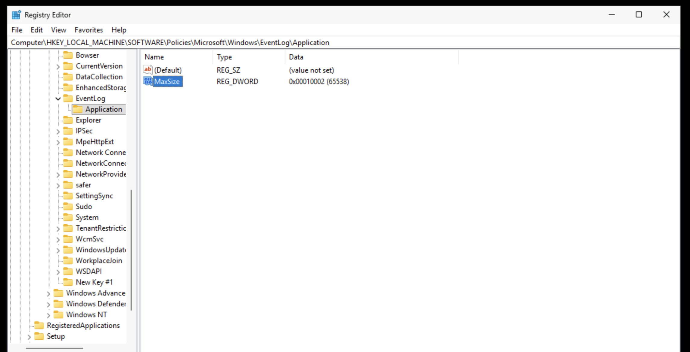
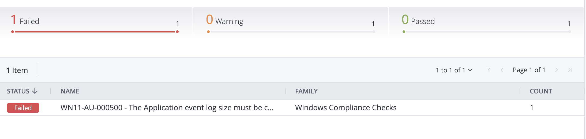
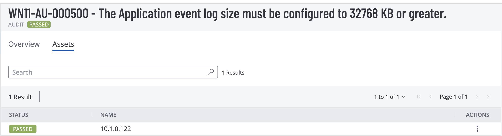

````markdown
# Windows 11 STIG Implementation & Vulnerability Management

## Overview
This project focused on identifying and remediating Windows 11 DISA STIG findings using Tenable compliance scans and manual remediation techniques.

The objective was to improve system hardening, validate compliance findings, and strengthen the overall security posture through vulnerability remediation and rescanning.

---

## Technologies Used
- Tenable / Nessus
- Windows 11
- PowerShell
- Registry Editor
- DISA STIGs
- Vulnerability Management
- Compliance Auditing

---

## Skills Demonstrated
- Vulnerability Management
- Security Hardening
- Risk Prioritization
- STIG Compliance
- Registry-Based Remediation
- Security Documentation
- Compliance Validation
- PowerShell Remediation

---

# Example Finding

## WN11-AU-000500
### Requirement
The Application event log size must be configured to `32768 KB` or greater.

---

## Initial Vulnerability Scan

The initial Tenable compliance scan identified the STIG finding as failed.


---

## Manual Validation

The registry configuration was manually reviewed to validate the existing configuration.

### Registry Path
```registry
HKEY_LOCAL_MACHINE\SOFTWARE\Policies\Microsoft\Windows\EventLog\Application
```

### Registry Validation Screenshot



---

## Group Policy Reset / Failure Validation

The policy was reverted to validate that the finding would fail again during rescanning.


### Failed Rescan Validation

The rescan confirmed the STIG failure condition.



---

## PowerShell Remediation

A PowerShell remediation script was developed to automate the STIG implementation.

```powershell
# WN11-AU-000500 Remediation
# Configure Application Event Log Size to 32768 KB

$registryPath = "HKLM:\SOFTWARE\Policies\Microsoft\Windows\EventLog\Application"
$valueName = "MaxSize"
$valueData = 32768

# Create registry path if it does not exist
if (!(Test-Path $registryPath)) {
    New-Item -Path $registryPath -Force
}

# Configure registry value
Set-ItemProperty -Path $registryPath -Name $valueName -Value $valueData -Type DWord

Write-Host "WN11-AU-000500 remediation applied successfully."
```

### PowerShell Remediation Execution


---

## Compliance Validation

After remediation, the system was rescanned in Tenable to validate successful STIG compliance.



---

# Outcome

This project provided hands-on experience with:
- vulnerability scanning
- Windows hardening
- DISA STIG remediation
- PowerShell automation
- registry-based remediation
- compliance validation
- operational security workflows
- vulnerability management lifecycle processes
````
